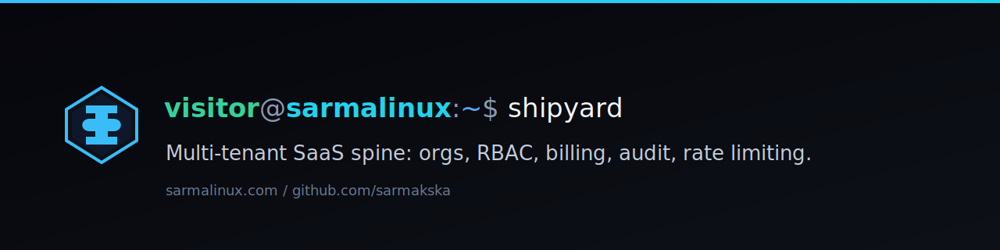
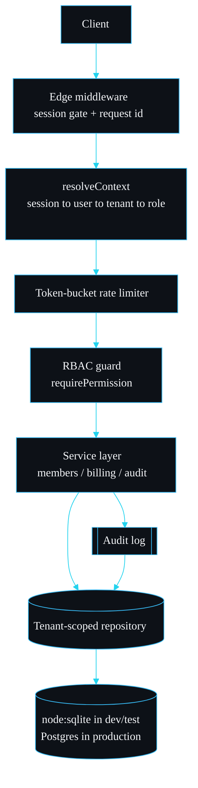

<p align="center"></p>

<p align="center">A production-grade multi-tenant SaaS starter: organisations, RBAC, billing, audit log and rate limiting done properly.</p>

<p align="center">
<a href="./LICENSE"></a>
<a href="https://github.com/sarmakska/shipyard"></a>
<a href="https://github.com/sarmakska/shipyard/commits"></a>
</p>

## The one test that has to pass

Before any feature, this is the test I write first on every B2B product. If it fails, nothing else matters.

```ts
it("an update cannot reach across tenants", () => {
  const { repo } = freshRepo();
  const auth = new AuthService(repo);
  const a = auth.signup({ email: "a@acme.test",   password: "pw-pw-pw-pw", organisationName: "Acme"   });
  const b = auth.signup({ email: "b@globex.test", password: "pw-pw-pw-pw", organisationName: "Globex" });

  const acmeMembership = repo.selectScoped(a.organisationId, "memberships")[0] as { userId: string };

  // Globex tries to demote an Acme member. The scoped update matches nothing.
  const changed = repo.updateScoped(
    b.organisationId,
    "memberships",
    { role: "viewer" },
    { userId: acmeMembership.userId },
  );

  expect(changed).toBe(0);
  expect((repo.selectScoped(a.organisationId, "memberships")[0] as { role: string }).role).toBe("owner");
});
```

Globex holds Acme's real `userId`, names the right table, and asks for a write it is allowed to make inside its own tenant. The update still touches zero rows. The reason is that `updateScoped` injects `organisationId = @organisationId` into the `WHERE` clause from the first argument, not from the caller's filter, so the statement reduces to "rows that are both Acme's membership and Globex's", which is the empty set. There is no second code path that skips this, because there is only one repository and it is the only way to reach tenant tables. The full walkthrough, including the smuggled-id insert case, is on the [Multi-Tenancy](https://github.com/sarmakska/shipyard/wiki/Multi-Tenancy) wiki page.

That single property is what shipyard exists to give you on commit one.

## Why I built this

I have started the same B2B SaaS three times, and each time I spent the first fortnight rebuilding the same unglamorous spine before I could touch the actual product: tenant isolation, sessions, a role model, an audit trail, rate limits, and a billing scaffold I would not be ashamed to demo. None of it is hard in isolation. The danger is that it is all easy to get *subtly* wrong, and the failures are the kind you find in production: a query that forgot its tenant predicate, a role check that lived in the client, a webhook that reactivated a cancelled plan because nobody validated the transition.

So I built the spine once, with the isolation and authorisation guarantees pinned down by tests rather than by good intentions, and made it run with no external services so it installs and proves itself on any machine. shipyard is opinionated about the hard parts and deliberately empty where your product lives.

## What you get

- **One chokepoint for tenant data.** Every tenant-scoped read and write goes through `Repository` in `src/db/repository.ts`, which stamps the tenant id onto inserts and ANDs it into reads and updates. A caller cannot construct a query that reaches another tenant, even by putting a foreign id in the payload.
- **Sessions you can leak.** Opaque random tokens, only a SHA-256 hash stored (`src/lib/auth.ts`). A database dump does not hand out live sessions. The plaintext token is the cookie; OAuth slots in at `createSession`.
- **Permission-based RBAC.** Routes assert a permission (`billing:manage`), not a role. Roles are bundles of permissions in `src/lib/rbac.ts`, and a missing check fails closed by throwing.
- **An append-only audit log.** Actor, tenant, action and JSON metadata for every privileged operation (`src/lib/audit.ts`), written through the scoped repository so an entry cannot be misattributed.
- **A token-bucket rate limiter** with an injected clock and a pluggable store (`src/lib/rate-limit.ts`), keyed by tenant and route.
- **A billing scaffold** with a real subscription state machine, usage budgets that return 402 instead of overrunning, and a Stripe-shaped adapter whose webhook signature check is the real HMAC scheme (`src/lib/billing/`).

It is Next.js 16 and TypeScript throughout. The data layer sits behind a typed repository on the built-in `node:sqlite`, and the same interface is what you reimplement against Postgres for production.

## Try it in a minute

```bash
pnpm install
SHIPYARD_DB_PATH=shipyard.db pnpm seed   # two demo organisations
pnpm test                                 # the guarantees, proved
SHIPYARD_DB_PATH=shipyard.db pnpm dev     # http://localhost:3000/login
```

Sign in as `owner@acme.test` / `password-acme-123` and open `/app/settings`: members, billing, usage and the audit trail, all resolved from one request context and scoped to the active tenant.

## How a request flows



Middleware is a cheap gate at the edge; the authoritative decision is made server-side in `resolveContext` where the database lives. See [Architecture](https://github.com/sarmakska/shipyard/wiki/Architecture).

## Design decisions

A few choices that shaped the project, including the ones I argued myself out of.

**`node:sqlite`, not better-sqlite3 or Prisma.** I wanted the test suite to be hermetic and the install to have no native build step. `better-sqlite3` is excellent but it is a compiled addon, which is exactly the thing that breaks in someone's CI on a Tuesday. Node's built-in `node:sqlite` (stable from Node 24) needs no compile and no service, so `pnpm install` is fast and `pnpm test` runs anywhere. I rejected an ORM for a different reason: the whole isolation argument rests on there being one narrow, auditable path to tenant data. A hand-written repository of about 230 lines is something I can read top to bottom and reason about; a generated query builder hides the `WHERE` clause that the entire guarantee depends on.

**A repository chokepoint, not Postgres RLS as the primary guard.** Row-level security is the obvious answer and it is genuinely good. I did not make it the primary mechanism because the project has to run and prove itself with zero services, and because an application-level guard fails loudly in a unit test on any database, whereas an RLS misconfiguration fails silently until production. So the repository is the guard you can test on commit one, and RLS is documented as the defence-in-depth backstop once you are on Postgres. Both, not one.

**Permissions at the call site, roles as bundles.** I considered checking roles directly (`if (role === "admin")`) because it is shorter. It rots: every new capability forces you to revisit every role comparison, and the meaning drifts. Asserting a permission (`requirePermission(role, "members:invite")`) keeps the route readable and lets the role table grow without touching call sites.

**Token bucket over a fixed window or a sliding-window log.** A fixed window double-rates at the boundary; a sliding-window log needs a timestamp list per key. The bucket is two numbers, `(tokens, lastRefill)`, which is also why it ports to a Redis Lua script unchanged. The reasoning is in [Rate Limiting](https://github.com/sarmakska/shipyard/wiki/Rate-Limiting).

## Limitations and non-goals

This is a spine, not a product, and being honest about the edges is part of the point.

- **SQLite is for dev and tests, not production.** The repository is built for the Postgres swap; the SQLite layer exists so the project installs and proves itself with nothing running. Do not ship it as your production database.
- **The Stripe adapter is a seam, not a client.** The webhook signature verification is real and tested. The customer and subscription calls throw with a pointer to the wiki until you `pnpm add stripe` and fill them in. I will not bundle a payment SDK into a starter.
- **Single-instance rate limiting out of the box.** The default bucket store is in-memory. Behind several instances the effective limit multiplies by the instance count until you wire the Redis store. The interface is there for exactly that.
- **Not a single-tenant skeleton.** If you are not building multi-tenant, the tenancy machinery is pure overhead and you should start elsewhere.
- **No UI framework opinion.** There is a minimal settings dashboard to prove the wiring. Bring your own design system.

## What I measured

Real numbers from my machine, an **Apple M3 Pro running Node v25.9.0**, not estimates.

```text
$ pnpm test
 Test Files  6 passed (6)
      Tests  29 passed (29)
   Duration  468ms

$ /usr/bin/time -p pnpm test   # whole command, including process spin-up
real 1.04
```

Six fresh in-memory databases, one per suite, so there is no shared state to leak between cases. What each suite proves:

| Suite | What it proves |
| --- | --- |
| `tenant-isolation` | Cross-tenant reads return nothing; a smuggled tenant id is overwritten; cross-tenant updates change zero rows. |
| `rbac` | A viewer is refused privileged actions; a user with no membership in the active tenant fails closed. |
| `audit` | Signup and invitations write entries with the correct actor, tenant and metadata. |
| `rate-limit` | The bucket allows up to capacity, blocks past it, refills at the configured rate and never exceeds the ceiling. |
| `billing` | Subscribe and webhook transitions are validated; illegal transitions are rejected; plan budgets stop usage overrun. |
| `stripe-webhook` | A correctly signed payload is accepted and mapped; a tampered or unsigned payload is rejected. |

## Roadmap

What I intend to add, and what I will not.

- **Will:** invitations by email token (not just direct membership), a Postgres repository implementation alongside the SQLite one, and a Redis `BucketStore` so the rate limiter is correct multi-instance.
- **Maybe:** organisation-switching in the session, and per-tenant feature flags.
- **Will not:** an ORM, a bundled payment SDK, or a UI kit. Those are decisions your product should make, and bolting them on here would undo the reason the spine is small enough to trust.

## Documentation

The wiki is the long form: [Home](https://github.com/sarmakska/shipyard/wiki/Home), [Architecture](https://github.com/sarmakska/shipyard/wiki/Architecture), [Multi-Tenancy](https://github.com/sarmakska/shipyard/wiki/Multi-Tenancy), [Auth and RBAC](https://github.com/sarmakska/shipyard/wiki/Auth-and-RBAC), [Billing](https://github.com/sarmakska/shipyard/wiki/Billing), [Audit Log](https://github.com/sarmakska/shipyard/wiki/Audit-Log), [Rate Limiting](https://github.com/sarmakska/shipyard/wiki/Rate-Limiting), [Deployment](https://github.com/sarmakska/shipyard/wiki/Deployment), [Roadmap](https://github.com/sarmakska/shipyard/wiki/Roadmap) and [Troubleshooting](https://github.com/sarmakska/shipyard/wiki/Troubleshooting). The same pages are mirrored in [`wiki/`](./wiki) so they always travel with the code.

## Licence

MIT. See [LICENSE](./LICENSE).

---
Built by Sarma. Part of the SarmaLinux open-source line.
Website: https://sarmalinux.com  .  GitHub: https://github.com/sarmakska
