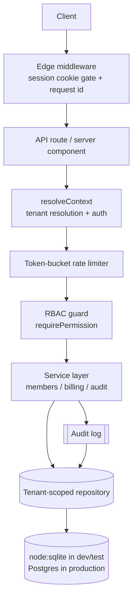

# shipyard

A production-grade multi-tenant SaaS starter: organisations, RBAC, billing, audit log and rate limiting done properly.

[](./LICENSE)
[](https://github.com/sarmakska/shipyard)
[](https://github.com/sarmakska/shipyard/commits)

shipyard is the multi-tenant foundation I reach for when I start a SaaS product, with the parts that are tedious and easy to get wrong already built and tested. It implements strict tenant isolation, session authentication, permission-based RBAC, an append-only audit log, a token-bucket rate limiter and a billing scaffold, all on Next.js 16 with TypeScript. It runs and tests with zero external services because the data layer sits behind a typed repository backed by the built-in `node:sqlite`, and the same interface swaps onto Postgres in production.

## Architecture



A request is gated by middleware, then `resolveContext` turns the session cookie into an authenticated user and an active tenant with a role. The rate limiter is checked, the RBAC guard asserts the required permission, and only then does the service layer run, writing through a repository that forces every tenant-scoped query to carry the tenant id. The full walkthrough is on the [Architecture](https://github.com/sarmakska/shipyard/wiki/Architecture) wiki page.

## Quickstart

```bash
pnpm install                                   # install dependencies
SHIPYARD_DB_PATH=shipyard.db pnpm seed         # seed two demo organisations
pnpm test                                      # run the suite (tenant, RBAC, billing, audit, rate limit)
pnpm build                                     # production build
SHIPYARD_DB_PATH=shipyard.db pnpm dev          # open http://localhost:3000/login
```

Sign in with `owner@acme.test` / `password-acme-123`, then open `/app/settings` to see members, billing, usage and the audit trail wired together.

## What is in the box

- **Multi-tenancy.** A single tenant-scoped repository (`src/db/repository.ts`) is the only path to tenant data. It injects `organisationId` into every read, write and update, so a caller cannot construct a query that reaches another tenant even by smuggling an id into the payload.
- **Authentication.** Session-based auth with scrypt password hashing (`src/lib/auth.ts` and `src/lib/crypto.ts`). Only a hash of the session token is stored, and there is a clean seam for OAuth providers.
- **RBAC.** Permission-based authorisation (`src/lib/rbac.ts`). Routes assert a permission through a `guard` helper; roles are bundles of permissions and fail closed.
- **Audit log.** Every privileged action is recorded with actor, tenant, action and JSON metadata (`src/lib/audit.ts`).
- **Rate limiting.** A token-bucket limiter with an injectable clock and pluggable store (`src/lib/rate-limit.ts`), applied to API routes through `withGuard`.
- **Billing.** Plans, subscription state machine and usage counters behind a provider interface (`src/lib/billing/`), with a fake provider for tests and a Stripe-shaped adapter whose webhook signature check is real.
- **Admin UI.** A minimal settings dashboard at `/app/settings` that resolves the request context once and renders only the active tenant's data.

## When to use this, and when not to

Use shipyard when you are starting a B2B SaaS product and want the multi-tenant and access-control spine in place from commit one, with tests that already prove the isolation and authorisation guarantees. It is opinionated about the hard parts and unopinionated about UI, so it leaves your product surface free.

Do not use it as a single-tenant app skeleton, where the tenancy machinery is pure overhead, and do not treat the SQLite layer as a production database. The repository interface is built for the swap to Postgres; SQLite is there so the project installs, builds and tests on any machine with no services running. The Stripe adapter ships its signature verification but needs the Stripe SDK to make live calls; see the [Billing](https://github.com/sarmakska/shipyard/wiki/Billing) wiki page.

## Results

The full suite runs against fresh in-memory databases, one per test, so there is no shared state to leak between cases.

| Suite | What it proves |
| --- | --- |
| `tenant-isolation` | Cross-tenant reads return nothing; a smuggled tenant id is overwritten; cross-tenant updates change zero rows. |
| `rbac` | A viewer is refused privileged actions; a user with no membership in the active tenant fails closed. |
| `audit` | Signup and invitations write entries with the correct actor, tenant and metadata. |
| `rate-limit` | The bucket allows up to capacity, blocks past it, refills at the configured rate and never exceeds the ceiling. |
| `billing` | Subscribe and webhook transitions are validated; illegal transitions are rejected; plan budgets stop usage overrun. |
| `stripe-webhook` | A correctly signed payload is accepted and mapped; a tampered or unsigned payload is rejected. |

```
Test Files  6 passed (6)
     Tests  29 passed (29)
```

## Documentation

The full documentation lives in the [wiki](https://github.com/sarmakska/shipyard/wiki): [Home](https://github.com/sarmakska/shipyard/wiki/Home), [Architecture](https://github.com/sarmakska/shipyard/wiki/Architecture), [Multi-Tenancy](https://github.com/sarmakska/shipyard/wiki/Multi-Tenancy), [Auth and RBAC](https://github.com/sarmakska/shipyard/wiki/Auth-and-RBAC), [Billing](https://github.com/sarmakska/shipyard/wiki/Billing), [Audit Log](https://github.com/sarmakska/shipyard/wiki/Audit-Log), [Rate Limiting](https://github.com/sarmakska/shipyard/wiki/Rate-Limiting), [Deployment](https://github.com/sarmakska/shipyard/wiki/Deployment) and [Troubleshooting](https://github.com/sarmakska/shipyard/wiki/Troubleshooting).

## Licence

MIT. See [LICENSE](./LICENSE).
