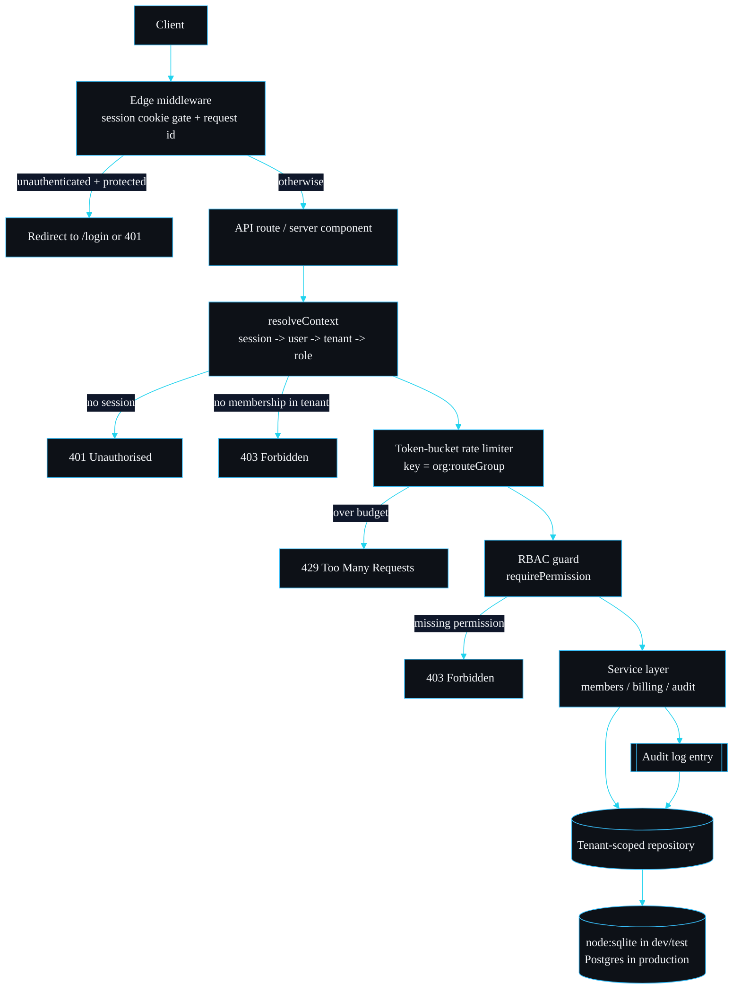

# Architecture

This page is the end-to-end picture of a request. Each later page drills into one stage.

## The request lifecycle



## Stages in order

### 1. Middleware

`src/middleware.ts` runs at the edge before any route. It does the cheap, request-scoped work: it reads the session cookie, short-circuits unauthenticated access to the protected surface (`/app/*` and `/api/protected/*`), and attaches a correlation id header. It deliberately does not make the authorisation decision, because the edge runtime has no database connection. The authoritative decision happens in the route where the data lives.

### 2. Tenant resolution and authentication

`resolveContext` in `src/lib/context.ts` is where the request becomes a `RequestContext`:

```ts
export interface RequestContext {
  user: User;
  organisationId: string;
  role: Role;
}
```

It resolves the session token to a session row, loads the user, reads the session's active organisation, and looks up the user's role within that organisation. If any step fails it throws: `AuthError` (401) for a missing or expired session, `TenantResolutionError` (403) for a user who is not a member of the active tenant. This is the single point where authentication and tenant resolution meet, and it fails closed.

### 3. Rate limiting

`withGuard` in `src/lib/http.ts` consumes a token from a bucket keyed by `organisationId:routeGroup` before the handler runs. Over budget returns 429 with a `Retry-After` header. See [Rate Limiting](Rate-Limiting).

### 4. Authorisation

`guard(ctx, permission)` calls `requirePermission`, which throws `ForbiddenError` (403) if the context's role lacks the permission. See [Auth and RBAC](Auth-and-RBAC).

### 5. Service layer and the repository

Only now does business logic run. Services (`MembersService`, `BillingService`, the audit helpers) operate through the tenant-scoped repository, which forces `organisationId` into every query. See [Multi-Tenancy](Multi-Tenancy).

## Layering

| Layer | Files | Responsibility |
| --- | --- | --- |
| Transport | `src/app/api/**`, `src/middleware.ts` | HTTP, cookies, status codes |
| Plumbing | `src/lib/http.ts`, `src/lib/context.ts` | Resolve context, rate limit, guard, map errors |
| Domain | `src/lib/{auth,members,audit,rbac}.ts`, `src/lib/billing/**` | Business rules, state machines |
| Data | `src/db/**` | Schema, migrations, tenant-scoped repository |

The dependency direction is strictly downward. The data layer knows nothing about HTTP, and the domain layer knows nothing about Next.js, which is what keeps the domain unit-testable without a server. The tables each layer touches are catalogued in [Data Model](Data-Model); the data layer's full surface is in [Repository Reference](Repository-Reference).

## Why node:sqlite

The data layer is backed by `node:sqlite`, the SQLite binding built into Node 22.5 and later. It needs no native build step and no running service, so `pnpm install` is fast and the test run is hermetic. The repository is the seam: in production you point it at a Postgres pool and the rest of the stack is unchanged. See [Deployment](Deployment).

## Error to status mapping

`errorResponse` in `src/lib/http.ts` centralises this so every route behaves the same:

| Error type | Status |
| --- | --- |
| `AuthError` | 401 |
| `TenantResolutionError` | 403 |
| `ForbiddenError` | 403 |
| `UsageLimitError` | 402 |
| anything else | 400 |

## Design decisions and the alternatives I rejected

The architecture is shaped by a few choices that were not obvious. Recording the ones I argued against is more useful than only listing what I kept.

**A repository chokepoint as the primary isolation guard, with Postgres RLS as a backstop, not the reverse.** Row-level security is genuinely good and I use it in production, but I did not make it the primary mechanism. Two reasons. First, the project has to run and prove itself with zero services, and an in-memory SQLite test cannot exercise an RLS policy. Second, an application-level guard fails loudly in a unit test on any database, whereas a misconfigured RLS policy fails silently until it reaches production. So the repository is the guard you can test on commit one; RLS is documented as defence in depth in [Deployment](Deployment).

**A hand-written repository, not an ORM.** The entire isolation argument rests on there being one narrow, readable path to tenant data. The repository is roughly 230 lines I can read top to bottom. An ORM or generated query builder hides the `WHERE` clause that the guarantee depends on, and that is the one place I want nothing hidden.

**The authorisation decision lives in the route, not the middleware.** The edge runtime has no database connection, so the middleware can only do cheap cookie work. Putting the authoritative tenant-and-role decision in `resolveContext`, where the data lives, keeps the security check next to the data and avoids a class of bug where the edge believes one thing and the route another.

**Errors as types, mapped centrally.** Each failure is its own error class (`AuthError`, `TenantResolutionError`, `ForbiddenError`, `UsageLimitError`) and `errorResponse` is the single place that maps them to status codes. The alternative, returning status codes from deep in the service layer, scatters HTTP concerns through the domain. Throwing a typed error keeps the domain HTTP-agnostic and the mapping in one auditable function.

---
SarmaLinux . sarmalinux.com . [shipyard on GitHub](https://github.com/sarmakska/shipyard)
