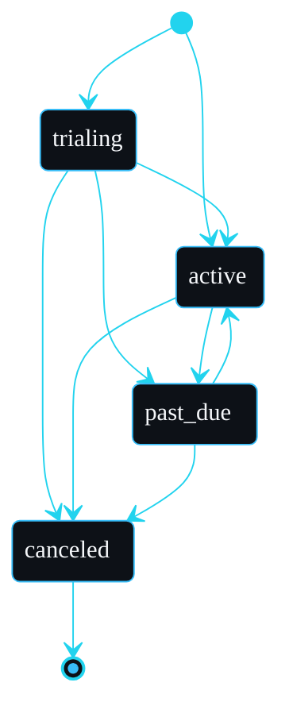

# Billing

The billing scaffold owns three things: the plan catalogue, the subscription state machine, and usage metering. It talks to payment providers only through an interface, so the application never depends on a specific vendor.

## Plans and budgets

`src/lib/billing/plans.ts` defines the catalogue. Each plan carries per-metric usage budgets for a billing period:

```ts
export const PLAN_CATALOGUE: Record<Plan, PlanDefinition> = {
  free:  { id: "free",  name: "Free",  pricePerMonth: 0,     budgets: { api_calls: 1000,   seats: 3 } },
  pro:   { id: "pro",   name: "Pro",   pricePerMonth: 4900,  budgets: { api_calls: 100000, seats: 25 } },
  scale: { id: "scale", name: "Scale", pricePerMonth: 29900, budgets: { api_calls: null,   seats: null } },
};
```

A `null` budget means unlimited. Prices are in minor units (pence).

## The provider interface

`src/lib/billing/provider.ts` is the seam:

```ts
export interface BillingProvider {
  createCustomer(input: CreateCustomerInput): Promise<{ customerId: string }>;
  createSubscription(input: CreateSubscriptionInput): Promise<ProviderSubscription>;
  cancelSubscription(subscriptionId: string): Promise<ProviderSubscription>;
  parseWebhook(payload: string, signature: string | null): ProviderEvent;
}
```

The application speaks only this interface. Two implementations ship.

### FakeBillingProvider

`src/lib/billing/provider-fake.ts` keeps customers and subscriptions in memory and parses webhook payloads as plain JSON. It drives the tests and local development, and it makes state transitions observable without a network. Paid plans begin in `trialing` and become `active` on an activation webhook, mirroring a real checkout.

### StripeBillingProvider

`src/lib/billing/provider-stripe.ts` is the real-provider seam. It is dependency-free on purpose: rather than bundle the Stripe SDK into a starter, it shows exactly where each call goes and implements the one genuinely security-sensitive piece for real, the webhook signature check.

```ts
const expected = createHmac("sha256", this.webhookSecret)
  .update(`${timestamp}.${payload}`)
  .digest("hex");
if (expectedBuf.length !== providedBuf.length || !timingSafeEqual(expectedBuf, providedBuf)) {
  throw new Error("webhook signature verification failed");
}
```

This is the same scheme Stripe uses: HMAC-SHA256 over `timestamp.payload`, compared in constant time. A forged or tampered payload is rejected before any state changes.

To go live:

1. `pnpm add stripe`.
2. Construct a Stripe client from `STRIPE_SECRET_KEY` in the adapter.
3. Replace each marked call (`createCustomer`, `createSubscription`, `cancelSubscription`) with the SDK equivalent. The Stripe event mapper in `mapStripeEvent` is already written.
4. Set `STRIPE_PRICE_PRO` and `STRIPE_PRICE_SCALE` to your Price ids.
5. Set `BILLING_PROVIDER=stripe`.

The provider is selected by environment in `src/app/api/protected/billing/route.ts`, so no application code changes.

## The subscription state machine

`src/lib/billing/service.ts` validates every transition. The allowed moves are:



`canceled` is terminal. An out-of-order or replayed webhook that tries an illegal move, for example reactivating a canceled subscription, is rejected with a `BillingError` rather than silently applied. Webhook events are also checked against the stored `providerSubscriptionId`, so an event for a different subscription cannot mutate this tenant's record.

Every transition writes an audit entry (`billing.subscribe`, `billing.webhook`, `billing.cancel`).

## Usage metering

`incrementUsage` enforces the plan budget atomically with the increment:

```ts
const budget = budgetFor(plan, metric);
const next = (existing?.count ?? 0) + amount;
if (budget !== null && next > budget) {
  throw new UsageLimitError(metric); // mapped to 402
}
```

So a usage call that would exceed the plan budget fails with a 402 rather than overrunning. Counters are keyed by `(organisationId, metric, period)` where period is the UTC month, and they are tenant-scoped like everything else, so one tenant's usage is invisible to another.

## Tests

`tests/billing.test.ts` and `tests/stripe-webhook.test.ts` cover subscribe, webhook activation, illegal-transition rejection, mismatched-subscription rejection, audit writes, usage increments, budget enforcement, unlimited usage on `scale`, per-tenant counter isolation, and Stripe webhook signature acceptance and rejection.

## Failure modes to know

- **`BillingError: illegal transition canceled -> active`.** A webhook tried to move a terminal subscription. This is the state machine refusing a replayed or out-of-order event, not a bug. If a customer genuinely resubscribes, that is a new `subscribe` call, not a webhook back into `active`.
- **`BillingError: event does not match stored subscription`.** The event's `providerSubscriptionId` is not the one stored for this tenant. This stops an event for one subscription mutating another tenant's record. Confirm the webhook is routed to the right organisation.
- **`webhook signature verification failed`.** The HMAC over `timestamp.payload` did not match. Usual causes: the wrong `STRIPE_WEBHOOK_SECRET`, or a proxy that re-serialised the body so the signed bytes changed. Verify against the raw request body. See [Troubleshooting](Troubleshooting).
- **`UsageLimitError` (402) sooner than expected.** The plan budget is per UTC month, keyed by `(organisationId, metric, period)`. A counter that looks low may belong to a previous period; the current period started at the month boundary.

---
SarmaLinux . sarmalinux.com . [shipyard on GitHub](https://github.com/sarmakska/shipyard)
