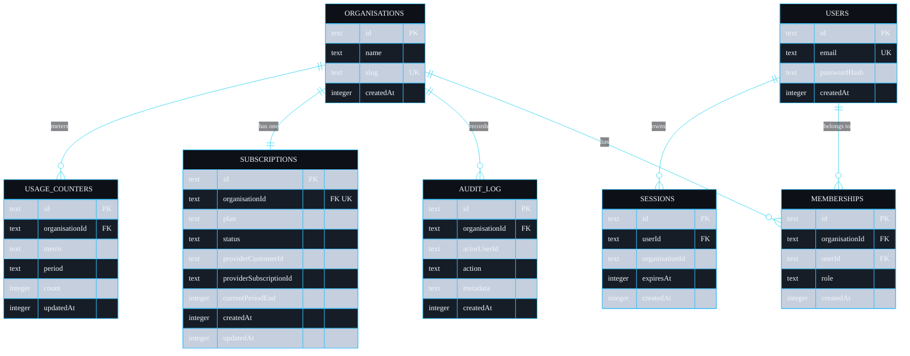

# Data Model

This page is the reference for every table shipyard stores: the columns, the types, the indexes, the on-disk encodings, and which side of the tenant line each table sits on. The single source of truth is `src/db/schema.ts`. The migrator in `src/db/client.ts` builds the SQL from these descriptors, so the schema you read in TypeScript is exactly the schema on disk.

## How the schema is declared

I describe each table as a plain TypeScript interface (for the application to use) plus a `TableDef` descriptor (for the migrator to read). The descriptor is small on purpose:

```ts
export interface ColumnDef {
  type: "text" | "integer" | "boolean";
  primaryKey?: boolean;
  notNull?: boolean;
  unique?: boolean;
  default?: string | number;
  references?: { table: string; column: string };
}
```

There is no migration framework. `Database.migrate()` walks `TABLES`, emits `CREATE TABLE IF NOT EXISTS` and `CREATE INDEX IF NOT EXISTS` for each, and runs them. It is idempotent, so it is safe to call on every boot. The function that turns a `ColumnDef` into a column clause is `columnClause` in `src/db/client.ts`; the function that turns a `TableDef` into statements is `createTableSql`.

This is deliberately not a general schema migration tool. It creates tables that do not yet exist. Altering an existing column in production is a Postgres concern, covered in [Deployment](Deployment).

## The entity relationship diagram



## The tenant line

Four tables hold tenant data and carry `organisationId`; three are global. The split is one declaration in `src/db/schema.ts`:

```ts
export const TENANT_SCOPED_TABLES = new Set([
  "memberships",
  "audit_log",
  "subscriptions",
  "usage_counters",
]);
```

| Table | Side | Why |
| --- | --- | --- |
| `organisations` | global | a tenant is not scoped to itself |
| `users` | global | a user can belong to several tenants; identity is cross-tenant |
| `sessions` | global | a session belongs to a user, and records the active tenant in a column |
| `memberships` | tenant | the join row that carries a user's role inside one tenant |
| `audit_log` | tenant | every entry is the record of something that happened in one tenant |
| `subscriptions` | tenant | one billing relationship per tenant |
| `usage_counters` | tenant | metered usage is per tenant per metric per period |

The repository refuses to touch a tenant table without an `organisationId` and refuses to use the scoped path on a global table. See [Multi-Tenancy](Multi-Tenancy) and [Repository Reference](Repository-Reference).

## Table by table

### organisations

The tenant root. `slug` is unique and is derived at signup from the organisation name plus the first eight characters of the id, so two organisations named "Acme" do not collide:

```ts
const slug = name.toLowerCase().replace(/[^a-z0-9]+/g, "-").replace(/^-|-$/g, "") + "-" + orgId.slice(0, 8);
```

### users

Identity, global by design. `email` is unique and is always stored trimmed and lower-cased (`input.email.trim().toLowerCase()` in `AuthService.signup` and `login`). `passwordHash` holds the self-describing scrypt string documented under encodings below.

### memberships

The many-to-many between users and organisations, carrying the `role`. A composite unique index stops a user being added to the same tenant twice:

```ts
indexes: [
  { name: "memberships_org_user_unique", columns: ["organisationId", "userId"], unique: true },
],
```

Roles are a fixed, ordered set: `owner`, `admin`, `member`, `viewer`. The role on a membership is the only thing RBAC reads to decide what a request may do; see [Auth and RBAC](Auth-and-RBAC).

### sessions

Server-side sessions. The primary key `id` is the SHA-256 hash of the plaintext token, not the token itself, so the table never stores anything that could be replayed as a cookie. `organisationId` here is the active tenant for the session and is what `resolveContext` reads as the tenant for the request. `expiresAt` is enforced on read; an expired session is deleted when encountered.

### audit_log

Append-only. `actorUserId` is nullable because a system action (a webhook) has no human actor. `metadata` is a JSON string with a default of `'{}'`. A composite index supports the common query, a tenant's entries ordered by time:

```ts
indexes: [
  { name: "audit_org_created", columns: ["organisationId", "createdAt"] },
],
```

There is no scoped update or delete called against this table anywhere, which is what makes it append-only in practice. See [Audit Log](Audit-Log).

### subscriptions

One per tenant: `organisationId` is both a foreign key and unique. `plan` is one of `free`, `pro`, `scale`; `status` is one of `trialing`, `active`, `past_due`, `canceled`. The `provider*` columns hold the customer and subscription ids from the billing provider, nullable until a provider call returns them. `currentPeriodEnd` is a millisecond timestamp. The state machine over `status` lives in `src/lib/billing/service.ts`; see [Billing](Billing).

### usage_counters

Metered usage, one row per `(organisationId, metric, period)`, enforced by a composite unique index:

```ts
indexes: [
  { name: "usage_org_metric_period_unique", columns: ["organisationId", "metric", "period"], unique: true },
],
```

`period` is the UTC month as `YYYY-MM`, computed by `currentPeriod` in the billing service. `count` defaults to `0`. The unique index is what lets the increment logic treat "find or create the counter for this period" as a single, race-safe slot.

## On-disk encodings

shipyard stores a small number of types and is explicit about each, so there is no ambiguity when you reimplement against Postgres.

| Logical type | SQLite storage | Notes |
| --- | --- | --- |
| id | `TEXT` | a v4 UUID from `randomUUID()` in `newId()` |
| timestamp (`createdAt`, `expiresAt`, ...) | `INTEGER` | milliseconds since the Unix epoch, from `Date.now()` |
| boolean | `INTEGER` | `0` or `1`; `toBind` coerces JS booleans before binding |
| `period` | `TEXT` | `YYYY-MM` in UTC, for example `2026-05` |
| `metadata` | `TEXT` | JSON, encoded by `JSON.stringify` in `recordAudit` |
| password hash | `TEXT` | `scrypt$N$r$p$salt$hash`, all hex; see [Auth and RBAC](Auth-and-RBAC) |
| session id | `TEXT` | hex SHA-256 of the plaintext token |

The coercion that makes this safe at the binding boundary is `toBind` in `src/db/repository.ts`: it maps `undefined`/`null` to SQL `NULL`, booleans to `0`/`1`, passes through numbers, bigints, strings and `Uint8Array`, and stringifies anything else as a last resort. If you add a column whose value is none of those, extend `toBind` rather than casting at the call site.

## Pragmas

The connection sets two pragmas at construction in `src/db/client.ts`:

```ts
this.raw.exec("PRAGMA foreign_keys = ON;");
this.raw.exec("PRAGMA journal_mode = WAL;");
```

`foreign_keys = ON` makes the `REFERENCES` clauses real constraints rather than documentation. `journal_mode = WAL` gives better read/write concurrency for the file-backed dev database; it has no effect on the in-memory test databases beyond being harmless.

## Mapping to Postgres

The descriptors carry everything you need for a faithful translation: `TEXT` stays `TEXT`, `INTEGER` becomes `BIGINT` (timestamps are milliseconds and outgrow 32 bits), `INTEGER` booleans become `BOOLEAN`. Primary keys, `NOT NULL`, `UNIQUE` and the foreign keys all map directly, and the composite indexes translate verbatim. The full procedure is in [Deployment](Deployment).

---
SarmaLinux . sarmalinux.com . [shipyard on GitHub](https://github.com/sarmakska/shipyard)
