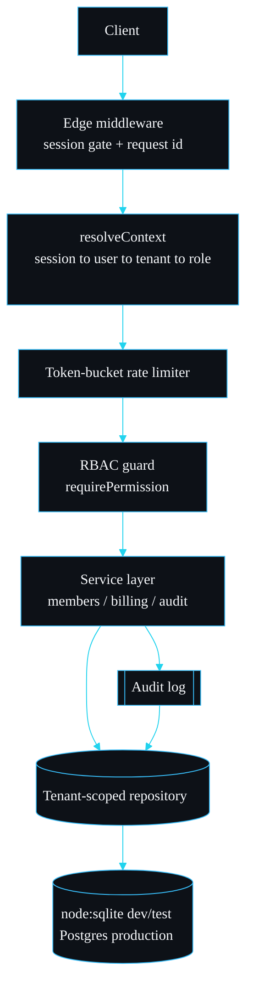

# shipyard

A production-grade multi-tenant SaaS starter: organisations, RBAC, billing, audit log and rate limiting done properly.

shipyard is the spine I start a B2B SaaS product on. It gets the parts that are tedious and easy to get subtly wrong right from the first commit: strict tenant isolation, session authentication, permission-based access control, an append-only audit trail, rate limiting and a billing scaffold. It is Next.js 16 and TypeScript, and it installs, builds and tests on any machine with no external services because the data layer sits behind a typed repository on the built-in `node:sqlite`. The same interface swaps onto Postgres for production.

## The system in 30 seconds



A request is gated at the edge, resolved to an authenticated user and an active tenant with a role, rate limited, authorised, and only then allowed into the service layer, which writes through a repository that forces the tenant id into every query.

## Where to go next

| Page | What it answers |
| --- | --- |
| [Architecture](Architecture) | How a request flows end to end, the layering, and the error-to-status map. |
| [Multi-Tenancy](Multi-Tenancy) | The isolation guarantee, the single chokepoint that enforces it, and the test that proves it. |
| [Auth and RBAC](Auth-and-RBAC) | Session handling, scrypt password hashing, and the permission model. |
| [Billing](Billing) | Plans, the subscription state machine, usage budgets, and the provider seam. |
| [Audit Log](Audit-Log) | What is recorded, how to add an action, and why it is append-only. |
| [Rate Limiting](Rate-Limiting) | The token-bucket algorithm, configuration, and scaling across instances. |
| [Deployment](Deployment) | The production path, including the Postgres swap and row-level security. |
| [Roadmap](Roadmap) | What I will add, what I will not, and the known limitations. |
| [Troubleshooting](Troubleshooting) | Concrete symptoms and their fixes. |

## Quickstart

```bash
pnpm install
SHIPYARD_DB_PATH=shipyard.db pnpm seed
pnpm test
pnpm build
SHIPYARD_DB_PATH=shipyard.db pnpm dev
```

Then open `http://localhost:3000/login` and sign in with `owner@acme.test` / `password-acme-123`.

## Design principles

1. **One chokepoint for tenant data.** Every tenant-scoped read and write goes through a single repository that injects the tenant id. There is no second path to forget.
2. **Fail closed.** A missing permission, an unknown session or a user with no membership in the active tenant all result in a refusal, never a fall-through.
3. **Inject the awkward dependencies.** The rate limiter takes a clock, the billing service takes a provider. That is what makes the hard paths testable.
4. **No service required to run the tests.** The whole suite runs against fresh in-memory SQLite databases, so the guarantees are verified anywhere.

---
SarmaLinux . sarmalinux.com . [shipyard on GitHub](https://github.com/sarmakska/shipyard)
