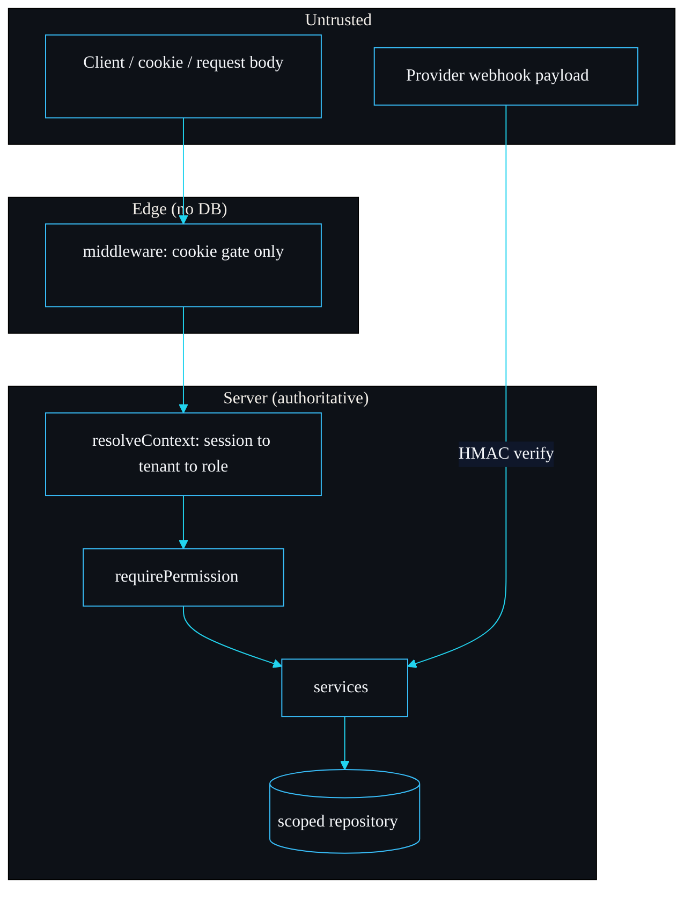

# Security Model

shipyard exists to get the security-sensitive parts of a B2B SaaS right on the first commit. This page is the consolidated threat model: what shipyard defends against, how, where the boundary is, and what is explicitly out of scope. Report findings privately to security@sarmalinux.com (see `SECURITY.md`).

## What we are protecting

The crown jewel is tenant isolation: one tenant must never read or write another tenant's data. Around that sit session integrity, authorisation, an immutable audit trail, and abuse resistance. Each has a single, testable enforcement point.

## Trust boundaries



The hard line is between the edge and the server. The middleware runs at the edge with no database, so it does only a cheap cookie gate and a correlation id. Every authoritative decision (who you are, which tenant, what role, what you may do) happens server-side in `resolveContext` and the guard, where the data lives. Nothing the client sends is trusted as identity, tenant or role.

## Threats and defences

### Cross-tenant read or write

**Defence:** the repository chokepoint. Every tenant-scoped statement has `organisationId = @organisationId` injected from the first argument, not from the caller's filter, and an `organisationId` in a payload or a `where` clause is overwritten or skipped. The active tenant comes from the session, not from the request body. A cross-tenant update matches zero rows.

**Why it is testable:** it fails loudly in a unit test on any database. `tests/tenant-isolation.test.ts` proves the read, write, smuggled-insert and cross-tenant-update cases directly. See [Multi-Tenancy](Multi-Tenancy).

### Session theft from a database leak

**Defence:** only a SHA-256 hash of the session token is stored; the plaintext token lives only in the httpOnly cookie. A dump of the `sessions` table cannot be replayed, because the stored hash is not a valid cookie value. Tokens are 32 bytes of CSPRNG entropy from `randomBytes`. Expired sessions are deleted on read in `resolveSession`, so a stale token cannot be replayed even before pruning.

### Session theft in transit or via script

**Defence:** the cookie is `httpOnly` (no JavaScript access), `sameSite: "lax"` (mitigates CSRF on cross-site navigations), `path: "/"`, and `secure` in production (HTTPS only). Set in `setSessionCookie` in `src/lib/http.ts`.

### Password cracking

**Defence:** scrypt, which is memory-hard, with the cost parameters stored alongside the hash so they can be raised over time without a migration. Verification is constant-time via `timingSafeEqual`. The login error is the same for an unknown email and a wrong password, so it does not reveal which accounts exist. Cost is ~25 ms per hash on this machine (see [Performance](Performance)).

### Privilege escalation

**Defence:** permission-based RBAC that fails closed. Routes assert a permission; a role that lacks it throws `ForbiddenError` (403). A permission absent from every role's bundle is held by nobody. A user with a session pointed at a tenant they do not belong to resolves with no role and is refused by `TenantResolutionError` (403), proved by the cross-tenant-session test in `tests/rbac.test.ts`. See [Auth and RBAC](Auth-and-RBAC).

### Forged or replayed billing webhooks

**Defence:** `StripeBillingProvider.parseWebhook` verifies an HMAC-SHA256 over `timestamp.payload` in constant time and rejects a missing, malformed or mismatched signature before any state changes. Beyond the signature, `BillingService.applyEvent` checks the event's `providerSubscriptionId` against the stored one and validates the state transition, so even a correctly signed but out-of-order event cannot, for example, reactivate a canceled subscription. Both layers are tested (`tests/stripe-webhook.test.ts`, `tests/billing.test.ts`). See [Billing](Billing).

### Abuse and brute force

**Defence:** the token-bucket rate limiter. The `auth` group is tight (five attempts, slow refill) to blunt credential stuffing, keyed by IP for unauthenticated routes. The `api` group is keyed by tenant so one noisy tenant cannot exhaust another's budget. See [Rate Limiting](Rate-Limiting).

### Tampering with the audit trail

**Defence:** the audit log is append-only in practice, because no code path calls a scoped update or delete on `audit_log`. Entries are written through the scoped repository so an entry cannot be misattributed to another tenant. In production on Postgres you reinforce this with a revoked `UPDATE`/`DELETE` grant. See [Audit Log](Audit-Log).

### SQL injection

**Defence:** every value is bound as a named parameter through `toBind`; nothing caller-supplied is interpolated into SQL. Table and column names come from the schema and method arguments, never from request bodies, and are quoted. The repository has no string-concatenation path for values.

## Defence in depth on Postgres

The application-level repository guard is the primary control because it is testable on commit one. In production you add row-level security as a backstop, so even a query that bypasses the repository is constrained by the database:

```sql
ALTER TABLE memberships ENABLE ROW LEVEL SECURITY;
CREATE POLICY tenant_isolation ON memberships
  USING (organisation_id = current_setting('app.current_org')::text);
```

Set `app.current_org` from the resolved context at the start of each request transaction. The reason RLS is the backstop and not the primary guard is that an RLS misconfiguration fails silently until production, whereas the application guard fails in a test; you want both, with the loud one first. See [Deployment](Deployment) and [Design Decisions](Design-Decisions).

## Explicitly out of scope

Being honest about the edges is part of the security posture.

- **SQLite in production.** The SQLite layer is for dev and tests. Ship on Postgres.
- **Live Stripe API calls.** Webhook verification is real and tested; the customer and subscription calls throw until you add the SDK. The signature path is the security-critical part and it is implemented.
- **Multi-instance rate limiting by default.** The in-memory store is per-instance; behind several instances the limit multiplies until you wire the Redis store.
- **Email-based invite tokens.** Invitations create memberships directly today; a single-use token flow is on the [Roadmap](Roadmap).
- **CSRF tokens.** The model relies on `sameSite: "lax"` plus the JSON content-type expectation. A high-assurance deployment should add explicit CSRF tokens on state-changing routes.

## Reporting

Private disclosure to security@sarmalinux.com. Cross-tenant reads or writes, RBAC bypasses and session forgery are exactly the findings I want. The acknowledgement and disclosure process is in `SECURITY.md`.

---
SarmaLinux . sarmalinux.com . [shipyard on GitHub](https://github.com/sarmakska/shipyard)
